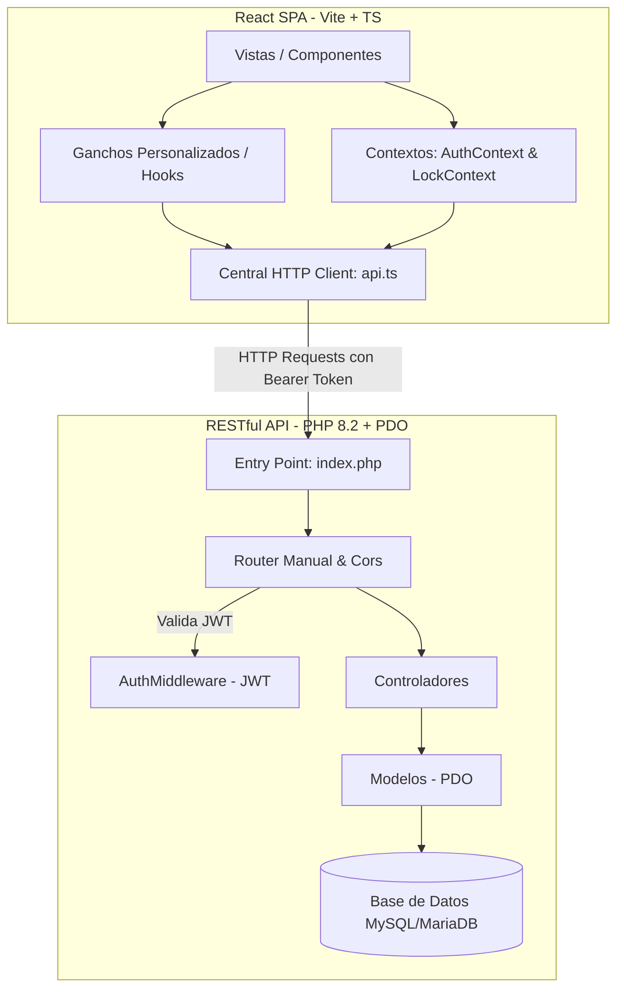

# SUPRE WMS — Mapa de Arquitectura y Conectividad (SUPRE_MAP)

Este documento describe la arquitectura global, las rutas principales, las dependencias críticas y la conectividad del sistema **SUPRE WMS** (Warehouse Management System), diseñado bajo una estructura desacoplada que separa un frontend SPA reactivo de un backend RESTful liviano y eficiente.

---

## 🏛️ 1. Arquitectura General del Sistema

El sistema está compuesto por dos grandes piezas independientes que interactúan mediante peticiones HTTP asíncronas sobre formato JSON:



### 🔹 Frontend (React SPA)
* **Paradigma:** Single Page Application (SPA) modular estructurada bajo una arquitectura orientada a características (**Feature-Driven Development**).
* **Gestión de Estado:** Manejo de datos locales a través de hooks personalizados que encapsulan las llamadas a servicios y reducen la lógica en componentes visuales. El estado global crítico (sesión de usuario y bloqueos de seguridad en tiempo real) se administra con React Contexts.
* **Control de Autorización Física/Digital ("Locks"):** Integra un sistema de llaves de acceso dinámicas controladas por el contexto `LockContext` y consumidas en caliente desde `LockApi`. Permite validar con códigos o autorizaciones de supervisor acciones críticas en la aplicación (ej: eliminar stock, aprobar compras, desincorporaciones) sin alterar el flujo UX principal.

### 🔹 Backend (RESTful API)
* **Paradigma:** Arquitectura de microservicios MVC modificada sin frameworks robustos (PHP puro, alto rendimiento y control total del ciclo de vida).
* **Enrutamiento:** Implementa un router manual de expresiones regulares optimizado en `backend/public/index.php` para resolver recursos en microsegundos.
* **Persistencia:** Capa de abstracción de base de datos directa sobre **PDO** (PHP Data Objects) implementada bajo el patrón **Singleton** para optimizar el pool de conexiones a MySQL/MariaDB.

---

## 📁 2. Estructura del Proyecto y Conectividad de Archivos

### 🌐 Frontend (Carpeta `src/`)

La estructura está distribuida en subcarpetas enfocadas en la separación de responsabilidades:

```
src/
├── App.tsx                    # Enrutador general y provisión de contextos globales
├── main.tsx                   # Punto de inicio e inyección del DOM de React
├── types.ts                   # Definición de tipos TypeScript compartidos en toda la app
├── components/                # Componentes comunes del sistema (Layout, Sidebar, Modales)
├── context/                   # Proveedores de estado global (AuthContext y LockContext)
├── services/                  # Capa de consumo de APIs externas e internas (api.ts, storage.ts)
├── pages/                     # Páginas base del sistema (Dashboard, Infrastructure, etc.)
└── features/                  # Módulos de lógica y UI estructurados por dominio:
    ├── catalog/               # Catálogo: Productos, categorías, proveedores
    ├── disincorporation/      # Mermas y salidas autorizadas
    ├── infrastructure/        # Configuración espacial (Almacenes, Estantes, Ubicaciones)
    ├── locks/                 # Gestión de llaves y candados de seguridad
    ├── purchasing/            # Recepción de compras y generación de lotes/bultos (Picking Lots)
    └── warehouse/             # Gestión de stock, movimientos de inventario e inventariado físico
```

#### ¿Cómo se conectan los archivos en el Frontend?
1. Las vistas de las páginas (`src/pages/*`) importan e integran subcomponentes de características específicas localizados dentro de `src/features/{feature}/components/*` o sus páginas de feature.
2. Cada feature utiliza un gancho personalizado (`src/features/{feature}/hooks/use{Feature}.ts`) que expone el estado y las funciones manipuladoras necesarias para la UI.
3. Este hook personalizado consume directamente las interfaces exportadas del cliente HTTP centralizado en `src/services/api.ts` (ej: `ProductApi.getAll()`, `StockApi.move()`).
4. Las llamadas en `src/services/api.ts` interceptan las peticiones para adjuntar de manera automática el Token de autorización JWT guardado localmente mediante `TokenService` (`supre_wms_token`).

---

### 🐘 Backend (Carpeta `backend/`)

Diseñado bajo una separación estricta entre la recepción de peticiones HTTP, el procesamiento lógico y el acceso a la base de datos:

```
backend/
├── public/
│   └── index.php              # Punto de entrada de la aplicación, configuración CORS y enrutador
├── database/
│   └── schema.sql             # Estructura física de la Base de Datos
└── src/
    ├── Config/
    │   └── Database.php       # Singleton para la conexión PDO
    ├── Helpers/
    │   └── Response.php       # Formateador estándar de salida JSON y cabeceras de error
    ├── Middleware/
    │   └── AuthMiddleware.php # Filtro interceptor para la validación y decodificación de tokens JWT
    ├── Controllers/           # Controladores de dominio (Reciben peticiones y delegan a modelos)
    │   ├── AuthController.php
    │   ├── ProductController.php
    │   ├── StockController.php
    │   └── ...
    └── Models/                # Acceso a datos (Consultas preparadas de SQL con PDO)
        ├── Product.php
        ├── Stock.php
        └── ...
```

#### ¿Cómo se conectan los archivos en el Backend?
1. El servidor web dirige toda petición hacia `backend/public/index.php` (vía `.htaccess` o configuración Nginx).
2. `index.php` ejecuta `AuthMiddleware::verify()` para validar la autenticidad del token de la sesión actual en peticiones protegidas.
3. El router dinámico ejecuta el callback correspondiente, instanciando un controlador de `backend/src/Controllers/` (ej: `StockController`).
4. El controlador recibe la petición, lee el payload JSON (de ser necesario), y hace llamados lógicos interactuando con los modelos asociados en `backend/src/Models/` (ej: `Stock` y `StockMovement`).
5. Los modelos utilizan la instancia estática PDO de `App\Config\Database::getInstance()->getConnection()` para ejecutar consultas preparadas seguras previniendo SQL Injection.
6. La respuesta se retorna formateada a través de `App\Helpers\Response::json()`.

---

## 🛣️ 3. Rutas Principales del Sistema

### 🗺️ Rutas del Frontend (React Router DOM)

| Ruta | Componente / Página | Propósito del Módulo |
|---|---|---|
| `/login` | `src/pages/Login.tsx` | Autenticación del usuario al sistema. |
| `/` | `src/pages/Dashboard.tsx` | Visualización general e indicadores clave de rendimiento (KPIs). |
| `/catalog` | `src/features/catalog/pages/CatalogPage` | CRUD de productos, costos, precios y dimensiones. |
| `/categories` | `src/features/catalog/pages/CategoriesPage` | Categorización, gestión de fraccionamiento e importación/exportación CSV. |
| `/providers` | `src/features/catalog/pages/ProvidersPage` | CRUD de proveedores y catálogos de origen. |
| `/infrastructure`| `src/pages/Infrastructure.tsx` | Creación de almacenes, tipos de espacios y sub-ubicaciones espaciales. |
| `/purchasing` | `src/pages/Purchasing.tsx` | Recepción de mercancía, creación de Picking Lots y embalaje en bultos. |
| `/warehouse` | `src/pages/Warehouse.tsx` | Panel de control de Stock, reubicaciones y picking list de salida. |
| `/disincorporation`| `src/pages/Disincorporation.tsx` | Registro de mermas, daños y robos con flujo de aprobación del supervisor. |
| `/movements` | `src/pages/StockMovements.tsx` | Kardex / Historial detallado de todas las transacciones físicas del stock. |
| `/locks` | `src/features/locks/pages/LocksPage` | Catálogo e interruptores de llaves físicas y digitales del almacén. |
| `/settings` | `src/pages/Settings.tsx` | Parámetros del sistema y control de perfiles y usuarios. |

---

### 📡 Endpoints Clave de la API (Backend)

*Todos los endpoints (salvo `/auth/login`) requieren la cabecera `Authorization: Bearer <JWT_TOKEN>`.*

| Método | Endpoint | Controlador Asociado | Propósito Técnico |
|---|---|---|---|
| **POST** | `/auth/login` | `AuthController::login()` | Valida credenciales e inicializa el token JWT firmado. |
| **GET** | `/products` | `ProductController::index()` | Obtiene la lista completa de productos. |
| **POST** | `/stock/move` | `StockController::move()` | Realiza transferencias físicas de productos entre ubicaciones. |
| **PATCH**| `/picking-lots/{id}/conform` | `PickingLotController::conform()` | Confirma la recepción física y consolida la mercancía en el stock. |
| **POST** | `/disincorporations` | `DisincorporationController::store()` | Registra una merma o salida física del stock con estatus PENDIENTE. |
| **PATCH**| `/disincorporations/{id}/approve` | `DisincorporationController::approve()` | Valida y descarga el stock permanentemente del inventario. |
| **POST** | `/locks/verify` | `AccessKeyController::verify()` | Evalúa si una llave de acceso ingresada autoriza una acción protegida. |

---

## 🛠️ 4. Dependencias Críticas y Propósitos

### 🚀 Frontend (Vía `package.json`)

* **`react` & `react-dom` (^19.0.0):** Librería núcleo para el desarrollo de la interfaz SPA.
* **`react-router-dom` (^7.13.1):** Gestor de rutas de navegación e historial en el frontend.
* **`tailwindcss` & `@tailwindcss/vite` (^4.1.14):** Motor de diseño de estilos CSS para interfaces responsivas ágiles.
* **`motion` (^12.23.24):** Motor de animaciones fluidas e interactivas para una UX premium.
* **`lucide-react` (^0.546.0):** Conjunto estandarizado de iconos de alta definición y consistencia.
* **`recharts` (^3.7.0):** Gráficos analíticos dinámicos e interactivos en el Dashboard y Estadísticas.
* **`@yudiel/react-qr-scanner` & `html5-qrcode`:** Librerías de escaneo para permitir lectura de códigos de barras/QRs físicos mediante cámaras del dispositivo.
* **`qrcode.react` (^4.2.0):** Generador de códigos QR vectoriales para etiquetado y trazabilidad de productos/bultos/ubicaciones.
* **`jspdf` & `jspdf-autotable`:** Generador de reportes físicos (PDF) y etiquetas de códigos QR de alta fidelidad desde el navegador.
* **`papaparse` (^5.5.3):** Analizador e importador/exportador ultra-rápido de archivos CSV.

---

### 🛡️ Backend (Vía `backend/composer.json`)

* **`firebase/php-jwt` (^6.10):** Librería estándar para la generación, decodificación y verificación criptográfica de tokens JWT (JSON Web Tokens).
* **`vlucas/phpdotenv` (^5.6):** Cargador automático de configuraciones críticas de variables de entorno desde un archivo `.env` aislado.
* **`pdo_mysql` (Extensión nativa de PHP):** Driver crítico para la interactuación eficiente mediante sentencias preparadas hacia la base de datos SQL.

---

## 🔄 5. Flujo de Comunicación de una Petición (Ejemplo Completo)

Para ilustrar la conectividad general, tomemos el flujo de **Mover stock entre ubicaciones**:

1. **Interacción del Usuario:** El operario en la pestaña `InventoryTab` del módulo `/warehouse` escanea el código QR de un producto y selecciona la ubicación destino, luego presiona "Trasladar".
2. **Lanzamiento de Acción:** El componente dispara la función expuesta por el hook `useWarehouse()`.
3. **Petición del Servicio API:** El hook ejecuta `StockApi.move({ productId, targetSpaceId, quantity })` dentro de `src/services/api.ts`.
4. **Envío HTTP:** El cliente HTTP centralizado intercepta la llamada, lee el token JWT actual de `localStorage`, lo inyecta en el header `Authorization`, y envía un `POST` al endpoint `/stock/move`.
5. **Recepción en Backend:** La petición llega al servidor y se enruta en `backend/public/index.php`.
6. **Middleware de Autenticación:** Se ejecuta `AuthMiddleware::verify()`. Este extrae el token JWT, verifica su firma con la clave simétrica `JWT_SECRET` en el `.env` y retorna el modelo de usuario actual si la firma es válida.
7. **Controlador:** El enrutador invoca a `StockController::move()`. Este recibe el objeto del usuario autenticado, extrae el cuerpo JSON de la petición y procesa la lógica de negocio.
8. **Operación de Base de Datos:** `StockController` delega en el modelo `Stock` y en `StockMovement`. Se ejecutan transacciones preparadas de SQL contra la base de datos mediante la conexión Singleton en `Database.php`.
9. **Respuesta JSON:** El controlador genera una estructura de éxito y la entrega formateada como JSON llamando a `Response::json(['data' => $resultado], 200)`.
10. **Actualización de UI:** El cliente en el frontend recibe la confirmación con estatus `200`, el hook actualiza el estado reactivo de React y la interfaz de usuario se actualiza para mostrar el stock en su nueva ubicación sin necesidad de recargar la página.
